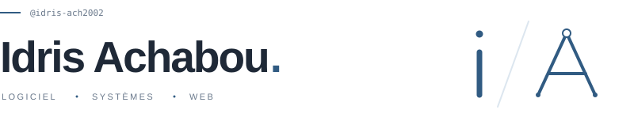
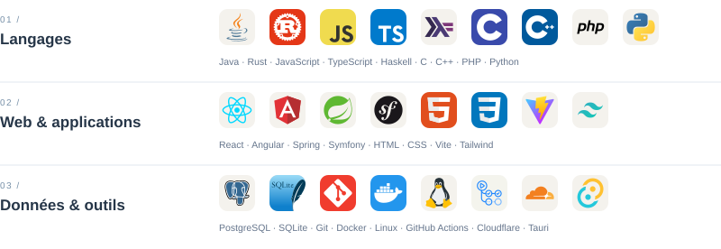
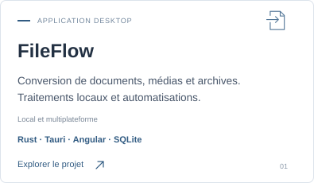
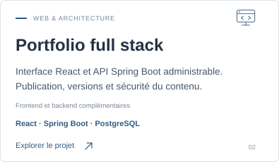
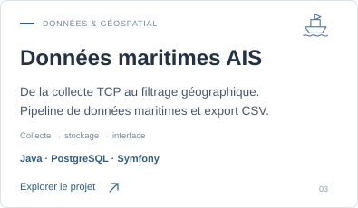
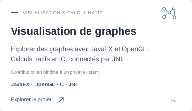
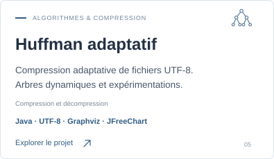
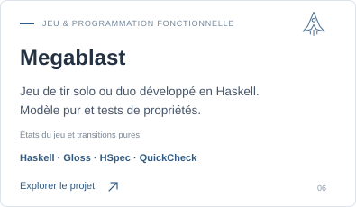
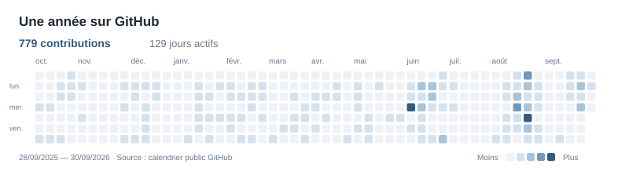

<h1><picture>
  
</picture></h1>

Je développe des applications **web et backend**, avec un intérêt pour les **systèmes** et l’**architecture logicielle**. J’aime construire des applications utiles et du code lisible.

<a href="https://idris-achabou.fit"><picture>
  
</picture></a>
<a href="https://www.linkedin.com/in/idris-achabou"><picture>
  
</picture></a>
<a href="mailto:achabou02idris@gmail.com"><picture>
  
</picture></a>
<a href="https://res.cloudinary.com/dji3ywrzt/image/upload/v1789157081/portfolio/CV_Idris_Achabou_Stage-db3aff2a-ef32-40f5-8d1f-8fdf0610624c.pdf.pdf"><picture>
  
</picture></a>

## Mon environnement

<picture>
  <source media="(max-width: 600px)" srcset="./assets/skills-profile-mobile.svg">
  
</picture>

## Projets à découvrir

[Tous mes dépôts](https://github.com/idris-ach2002?tab=repositories)

## Au fil du code

<picture>
  
</picture>

